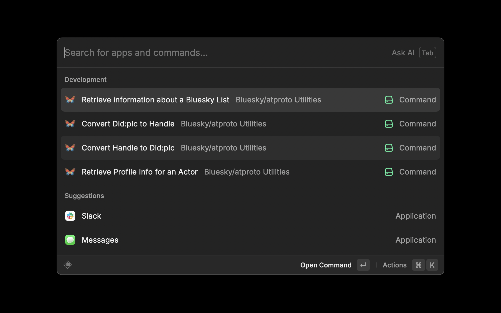

# Bluesky/atproto Utilities

Various Raycast helper commands to work with Bluesky/atproto URLs, handles, DIDs, etc.

## Installation

This will eventually be in the Raycast app store but until then you can:

```bash
$ git clone https://github.com/hrbrmstr/bluesky-atproto-utilities.git
$ cd bluesky-atproto-utilities
$ npm i
$ npm build
```

and you should see the various utilities in Raycast.

## Current Functions




